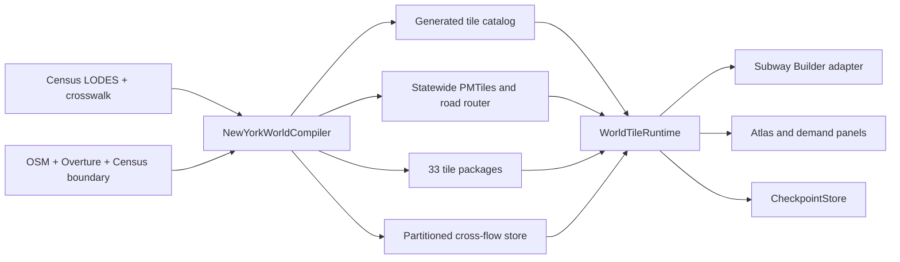

# New York State NYC-scale tiled test plan

Status: Milestones 0–2 implemented and passed; Milestone 3 pending  
Date: 2026-08-11  
Purpose: scale the working Kansas City prototype into a 33-tile New York State test while keeping one authoritative world, bounded runtime memory, recoverable saves, and honest cross-tile simulation.

The factual measurements behind this plan are in [New York State large-test research](../research/new-york-state-large-test-research.md). The existing two-tile architecture and its original invariants are documented in [Kansas City two-tile plan](kansas-city-two-tile-mod-plan.md).

## 1. Decision summary

Use a fixed, north-up ownership grid in **NAD83 / UTM zone 18N (EPSG:26918)**:

| Property | Decision |
| --- | --- |
| Ownership width | **77,700 m** |
| Ownership height | **97,300 m** |
| Grid origin | **553,400 m E, 4,483,300 m N** |
| NYC base tile | column `0`, row `0` |
| Ownership rule | `[min_x, max_x) × [min_y, max_y)` |
| Immutable-data halo | **2,000 m** on every generated package |
| Substantive New York tiles | **33** |
| Addressable shoreline slivers | **2 empty records** |
| Full rectangular address space | 9 columns × 7 rows = 63 possible cells |

The tile dimensions are the rounded containing envelope of the installed first-party NYC roads footprint. Subway Builder does not define a formal city rectangle, so roads are the best proxy for the playable simulation extent; the visual PMTiles archive is substantially larger and should not determine ownership.

Generate only the 33 cells whose intersection with the official 2024 Census New York boundary exceeds 1 km². Keep the two smaller intersections in the catalog as non-playable sliver records so the grid remains deterministic. Do not generate the other 28 empty bounding-box cells.

Use **LODES8 2023 `JT01` Primary Jobs**. The required New York `main`, `aux`, and crosswalk inputs total 49.0 MiB compressed, 591.0 MiB extracted, 7,801,578 OD rows, and 288,819 crosswalk rows. The [LODES documentation](https://lehd.ces.census.gov/doc/help/onthemap/LODESTechDoc.pdf) defines `JT01` and the OD fields; the current files are listed in the official [New York OD directory](https://lehd.ces.census.gov/data/lodes/LODES8/ny/od/) and [state directory](https://lehd.ces.census.gov/data/lodes/LODES8/ny/).

## 2. What this test must prove

The New York build is a systems test, not merely a larger map. It must prove that:

1. The mod can register and switch among at least 33 normal city packages without hard-coded tile IDs.
2. Only the active tile is represented as full native game state; inactive tiles remain compact snapshots and aggregate simulation records.
3. An autosave loads the matching mod checkpoint even when newer autosaves exist, and only the latest ten autosave checkpoints are retained.
4. Player tracks, routes, trains, money, and world time survive arbitrary tile-switch and save-load sequences.
5. Local commuters remain native pops, while cross-tile commuters have one canonical identity and are never duplicated across tile projections.
6. Daily cross-tile mode choice works on a multi-tile path rather than pretending every trip crosses one KC-style gateway.
7. Disk use, renderer memory, build memory, and transition latency remain bounded as tile count increases.

The first statewide milestone does not need continuous train animation across inactive tiles. It does need consistent service, travel time, ridership, and revenue across those tiles.

## 3. Scope and data boundary

### Included

- All 33 substantive New York ownership tiles.
- One statewide visual map archive, exposed to every tile without physical duplication.
- Tile-local roads, collision/building data, demand, and optional foundation assets.
- All LODES pairs whose home and work endpoints are both in New York.
- New York `aux` flows retained as an external-boundary ledger for measurement.
- A generated atlas catalog used by both the map panel and runtime.
- Arbitrary sequences of adjacent tiles in cross-tile transit paths.
- Offline driving times calculated on a statewide external road router.

### Deliberately deferred

- Complete New York-resident outbound commuting. New York's own `aux` file contains outside residents working in New York; New York residents working outside the state live in other workplace states' files.
- Native train physics while a train is in an inactive tile.
- A national projection or national tile key. EPSG:26918 is a New York test choice.
- Loading every cross-city cohort or every inactive network into the renderer at once.

External flows must be labeled `EXTERNAL`, excluded from in-state conservation totals, and never silently treated as ordinary cross-tile trips.

## 4. Size and capacity budget

The installed first-party NYC package is **293.8 MiB**. A blind 33× multiplication is approximately **9.7 GiB**, which is the useful pessimistic ceiling—not the expected result—because NYC is unusually dense and its 164.1 MiB visual PMTiles archive must not be copied into every package.

Use these gates:

| Metric | Target | Hard gate |
| --- | ---: | ---: |
| Final installed New York world | 3–8 GiB | 12 GiB |
| Free scratch space before first full Depot run | 50 GiB | 30 GiB minimum |
| Peak data-pipeline memory | ≤ 12 GiB | 16 GiB |
| Active native tile + demand working set | ≤ 750 MiB | 1.5 GiB |
| Persistent statewide cross-demand index in renderer | ≤ 100 MiB packed | 250 MiB |
| Warm tile transition p95 | ≤ 2 s | 5 s |
| Cold tile transition p95 | ≤ 5 s | 10 s |
| Daily cross-tile recalculation | background, ≤ 2 s p95 | 5 s without blocking input |

The six-tile pilot described below must produce an extrapolation report before the full state build starts. Extrapolate from actual feature counts and bytes by density class; do not estimate all of New York from the raw Census gzip size.

Build intermediates must be content-addressed and deleted after their final artifacts pass checksum validation. Keep source downloads, final packages, manifests, and compact benchmark reports; do not retain a separate multi-gigabyte GeoJSON expansion for every tile.

## 5. Target architecture



The runtime should expose a small world-level interface; callers must not directly patch native saves or coordinate checkpoint files:

```ts
interface WorldTileRuntime {
  boot(saveIdentity: SaveIdentity): Promise<WorldView>;
  transitionTo(tileId: TileId): Promise<TransitionResult>;
  advanceDay(day: GameDay): Promise<DailyWorldResult>;
  checkpoint(saveIdentity: SaveIdentity): Promise<CheckpointResult>;
}
```

Deepen the current shallow helpers into five modules:

1. **`TileCatalog`** — owns the grid, stable IDs, neighbors, display bounds, package manifests, and atlas metadata.
2. **`TilePackageStore`** — validates and loads active-tile assets; implementations are HTTP/local-host and in-memory test adapters.
3. **`CheckpointStore`** — maps an exact game-save identity to a world checkpoint, enforces ten-autosave retention, and garbage-collects unreferenced blobs.
4. **`CrossTileRouter`** — owns gateway graph traversal, saved network summaries, multi-tile transit paths, daily mode choice, and revenue events.
5. **`SubwayBuilderGameAdapter`** — remains the only module permitted to touch hidden bundle state or native save fields.

Tests should target these interfaces and observable state. Do not add another layer of tests tied to the current KC helper functions.

## 6. Storage model required before statewide saves

The current pattern of embedding a full native snapshot and copied shared network in every checkpoint does not scale to 33 tiles × 10 autosaves. Replace it before the full-state soak test.

A checkpoint manifest should reference immutable or content-addressed pieces:

```text
checkpoint/<saveIdentity>.json
  worldLedgerHash
  globalNetworkHash
  activeTileId
  tileSnapshotHashByTile
  cameraAndUiState
  createdAt
```

Rules:

- A tile snapshot is written only when that tile changed.
- Global tracks/routes/service definitions are stored once per revision, not copied into every tile snapshot.
- Loading a game save resolves its exact `saveIdentity`; it must not select the newest mod state.
- If an exact checkpoint is absent, recovery may use only a checkpoint proven not later than the native save, followed by explicit reconciliation.
- After the eleventh autosave checkpoint commits, delete the oldest manifest, then garbage-collect blobs no longer referenced by any retained checkpoint.
- Manual saves and autosaves use separate identities but the same storage engine.
- Garbage collection runs after a successful commit and at startup repair, never midway through a transition.

This makes ten retained autosaves approximately ten small manifests plus changed-state deltas, not ten complete copies of the state.

## 7. Generated catalog and tile identity

Replace the KC-specific source catalog with one generated artifact shared by the pipeline and mod build. Each record contains:

- signed grid column and row;
- stable logical tile ID and filesystem-safe game city code;
- ownership polygon and 2 km halo;
- New York intersection area and `normal | sliver | empty` status;
- neighbor IDs for all shared edges;
- package URLs, sizes, hashes, and schema versions;
- initial camera position and atlas label;
- demand, road, collision, and optional foundation capabilities.

Keep `(0,0)` stable as the NYC base tile. Derive IDs from grid coordinates rather than array order, so regenerating the state boundary cannot renumber existing saves. The build should emit a bundled `tile-catalog.generated.js` for synchronous mod registration and a matching `tile-catalog.json` for data tools and diagnostics.

No runtime module may import `KCW`, `KCE`, assume two tiles, or use a single corridor code after this conversion.

## 8. Data harvesting and compilation

### D0 — Freeze sources and geometry

- Add `world-ny.yaml` containing the grid contract and >1 km² package threshold.
- Pin the official 2024 Census boundary URL, byte count, and SHA-256. Census publishes the state cartographic boundary on its [2024 Cartographic Boundary Files page](https://www.census.gov/geographies/mapping-files/2024/geo/carto-boundary-file.html).
- Pin LODES URLs, sizes, extracted hashes, vintage, and `JT01` selection.
- Pin the Depot commit, OSM extract vintage, Overture release, router image/version, and compiler version.
- Emit the 35 addressable catalog records and a coverage GeoJSON for visual review.

### D1 — Build an out-of-core block and OD store

- Stream the crosswalk into a disk-backed table keyed by 15-digit block ID.
- Stream `main` and `aux`; never materialize 7.8 million CSV rows as JavaScript or Python objects.
- Assign home and work coordinates to the half-open ownership grid.
- Write partitioned Parquet or DuckDB tables by `(home_tile, work_tile)`.
- Produce counts and worker mass for local, in-state cross-tile, inbound external, unresolved, and zero-coordinate rows.
- Validate workplace and residence totals with `WAC/RAC S000 JT01` where their coverage semantics match.

The first gate is exact mass conservation from raw OD `S000` through the partitioned store.

### D2 — Compile demand with the established aggregation rules

For each endpoint role:

1. Create stable spatial sites and merge sites within 100 m.
2. Merge undersized compatible cohorts toward a nearby site until they reach at least 50 people where possible.
3. Split each cohort above 200 into stable chunks no larger than 200.
4. Allow a demand point to contain any total population and any number of cohorts.
5. Never merge across an ownership boundary merely to meet the minimum.
6. Retain unavoidable sparse residuals below 50 with an explicit validation warning rather than dropping or moving people arbitrarily far.

IDs must derive from source endpoint IDs, aggregation version, and deterministic split index. Rebuilding unchanged inputs must reproduce the same point and cohort IDs.

### D3 — Generate realistic driving costs

- Build one statewide OSRM or Valhalla graph from the pinned OSM extract.
- Snap aggregated demand sites, not raw OD rows, to router nodes.
- Cache by `(origin_road_node, destination_road_node, router_version)`.
- Store driving seconds and distance for every compiled cohort.
- Store full driving geometry only in a compressed, lazy route cache used when the demand detail panel requests it.
- Record fallback reason and straight-line estimate for unsnappable or disconnected pairs.

The mode-choice runtime must never run a live internet router.

### D4 — Generate Depot assets by tile

- Produce one statewide visual PMTiles pyramid with byte-range support. If the game requires a city-specific URL, register aliases to the same archive rather than making 33 copies.
- Generate collision/building index, roads, runway/taxiway data, and any required ocean/coast data independently for each ownership tile plus its 2 km halo.
- Keep ownership-sensitive demand and native data clipped to the ownership rectangle; halos may duplicate immutable features only.
- Replace Depot stages that build full-state GeoJSON, call `fetchall`, or retain whole building dataframes.
- Process one or a small bounded number of tiles at a time and emit peak RAM, scratch bytes, feature counts, and duration per stage.
- Validate the 2 km halo with stations placed just inside each edge. Increase the halo only if an edge-path test proves that the game's actual catchment/routing needs more context.

### D5 — Package cross-tile data without statewide duplication

Do not put a copy of all New York cross-demand in every tile.

- Store one packed global cohort table keyed by stable cohort ID.
- Store per-tile resident and worker indexes containing IDs, location, population, and current summary color.
- Partition pair records by home tile and work tile.
- Keep panel detail pages and path geometries lazy-loaded.
- Put only local native demand in `demand_data.json.gz`.
- Include counts, compressed/uncompressed bytes, hashes, and source versions in each manifest.

## 9. Runtime generalization

### R0 — Remove two-tile assumptions

- Replace the static `TILE_IDS` array and KC labels with the generated catalog.
- Replace `CORRIDOR_TILESET = KCOW` with a world asset descriptor.
- Make startup choose the tile recorded by the exact checkpoint, then the save's coordinates, then NYC `(0,0)` as the final fallback.
- Register the atlas and cross-city demand panels through the same reload-safe mod-API lifecycle used by Induced Demand.
- Ensure sliver records appear only as non-selectable context and never enter native city loading.

### R1 — Make transitions scale with active state, not tile count

The switch transaction remains pause → snapshot → reconcile → prepare → load → overlay authoritative globals → verify → commit → resume, but must touch only:

- the source tile snapshot;
- the destination tile snapshot;
- the global wallet, clock, and network revision;
- cross-flow partitions involving either tile;
- a small prefetched destination manifest.

A transition must not scan all 33 native saves or deserialize the statewide cohort table.

### R2 — Separate the global network from native tile snapshots

The detailed implementation and validation sequence for this section is defined in [Bounded native network projection plan](bounded-network-projection-plan.md).

- Give every track, station, route, and train a stable global ID plus an owning tile or boundary-service role.
- Save tile-local geometry once under its owner.
- Save route/service definitions globally as references to ordered tile-local segments.
- Materialize only the bounded active 3×3 render window's native objects into the game adapter.
- Preserve compact inactive service summaries for mode choice and revenue.
- Merge by revision and ID, never by taking whichever autosave happens to be newest.

### R3 — Implement true multi-tile commutes

Replace the current single-gateway pair with an ordered path:

```text
home walk/access leg
home-tile transit leg
zero-walk boundary handoff(s) for the same through service
intermediate inactive-tile service leg(s)
work-tile transit leg
work egress leg
```

`CrossTileRouter` should search a graph whose vertices are tile-edge gateways and whose edges are saved player services. A through train crossing a boundary adds neither walk time nor a second wait. A required transfer between services adds the same perceived wait/generalized-cost logic as the base game.

Recalculate cross-tile mode share once per game day, as already chosen for the prototype. Run it in a worker against packed profiles. Recompute all affected cohorts when the global network/fare revision changes; otherwise reuse unchanged path candidates and refresh the daily choice values. Commit results atomically so the overlay never displays a mixture of two days.

### R4 — Account for cross-tile revenue once

- A canonical cohort produces one fare/revenue event for its completed journey according to the configured fare policy.
- Tile projections may display the event but cannot independently credit it.
- Revenue enters the authoritative world ledger before the destination native snapshot is loaded.
- Daily profit, wallet, route statistics, and the cross-demand panel must reconcile to the same event IDs.

## 10. Staged delivery

### Milestone 0 — Grid and inventory

Deliver the frozen world config, 35-record catalog, source lockfile, coverage preview, LODES partition inventory, and mass-conservation report.

Gate: the NYC footprint is `(0,0)`, no point has two owners, every in-state endpoint has one owner, and the 33/2 tile classification is reproducible.

**Result, 2026-08-11: PASS.** The compiler generated 33 normal records and two slivers, assigned all 288,819 crosswalk blocks without an unplanned cell, classified 7,801,578 OD rows / 8,557,098 workers with zero row or worker delta, and found 987 occupied in-state tile pairs. See the [Milestone 0 prototype](../prototype/ny-state/README.md) and [generated inventory](../prototype/ny-state/generated/reports/lodes-tile-inventory.md).

### Milestone 1 — Generalized runtime on fixtures

Generate 35 tiny fixture packages and remove all two-tile assumptions. Exercise atlas selection, exact checkpoint lookup, ten-autosave retention, global network references, and arbitrary switching with fake adapters.

Gate: 1,000 randomized transitions and save loads preserve clock, wallet, network IDs, and cohort mass without work proportional to 35 full snapshots.

**Result, 2026-08-11: PASS.** The build emits 35 independently addressable fixture manifests. The pure checkpoint/reference model and the real `WorldTileRuntime` each completed 1,000 catalog-injected transitions. A transition touched at most two tile records and deserialized at most one snapshot; exact older-save loading, ten-save retention, content-addressed garbage collection, and global track/route continuity passed. The existing KC regression suite remains green (82/82). See the [runtime soak report](../prototype/ny-state/generated/reports/runtime-soak.md) and [self-contained logic lab](../prototype/ny-state/logic-prototype.html).

### Milestone 2 — Six-package density pilot

Build:

- the four-tile dense NYC/Long Island/lower-Hudson cluster;
- one medium upstate urban tile selected by measured building/demand density;
- one Adirondacks/rural tile.

Run Depot, routing, demand, package, switch, save, and one-day simulation benchmarks. Extrapolate final disk and build time using per-density-class feature counts.

Gate: projected installed size ≤ 12 GiB, pipeline memory ≤ 16 GiB, no single package exceeds active-state limits, and warm switching remains ≤ 5 seconds.

**Result, 2026-08-11: PASS, with an in-game integration check carried into Milestone 3.** Six independently loadable real-data packages were generated from 2023 LODES and dated 2026-08-10 OSM data. The packages span 11.8–333.5 MiB, the conservative statewide projection is 2.42 GiB, Depot peaked at 13.95 GiB RSS under its 16 GiB limit, and the bounded-memory warm-load proxy reached 2.84 s p95. The generated-road benchmark built all six graphs (including 1.69 million NYC nodes) and completed sample shortest-path queries. Full-cohort one-day traversal took 0.31 s for 93,470 cohorts, and checkpoint retention kept ten of eleven autosaves. The remaining caveat is that the proxy does not include Electron renderer teardown/reconstruction; validate that against the installed game before mass-producing the remaining packages. See the [Milestone 2 feasibility report](../prototype/ny-state/generated/pilot/reports/milestone2-feasibility.md).

### Milestone 3 — Full statewide static and local-demand build

Generate the remaining 27 normal packages, the shared PMTiles archive, router cache, local native demand, and partitioned cross-flow store. Validate each package before deleting its intermediates.

Gate: all 33 packages load independently, exact local worker/resident totals are conserved, and no state-wide payload is duplicated per tile.

### Milestone 4 — Statewide switching and checkpoints

Exercise the atlas across every tile, populate representative networks, save ten autosaves, load them newest-to-oldest and oldest-to-newest, then create the eleventh autosave and verify garbage collection.

Gate: every save restores its own routes/tracks/trains, time, and wallet; storage growth follows changed blobs rather than `tiles × autosaves`.

### Milestone 5 — Cross-tile mode choice

Start with adjacent dense tiles, then a three-tile through service, then a long statewide chain. Validate path display, base-game catchment rules, driving time, wait/generalized cost, mode-share color, ridership, and credited fares.

Gate: daily recalculation meets its time budget, through riders incur no artificial gateway walk/wait, and revenue is credited exactly once.

### Milestone 6 — Soak and verdict

Run 100 manual atlas switches across a deterministic route, 30 simulated game days, repeated mod reloads, and deliberate interruption at every transition phase.

Record one verdict: proceed with fixed NYC-sized tiles; proceed with adaptive subdivision; proceed only after a loader/storage patch; or stop.

## 11. Required validation and telemetry

### Data invariants

- Stable source hashes and reproducible catalog IDs.
- No ownership gaps or overlaps for included endpoints.
- `local + in-state cross-tile + explicit external = classified input` worker mass.
- Every canonical cohort has exactly one home, one work, one population, and zero or more projections.
- Cohort size ≤ 200; demand-point total is unrestricted.
- Rebuilds with identical inputs reproduce IDs, counts, and byte hashes.

### Runtime invariants

- Exactly one active native tile.
- Monotonic world time and revisions.
- One authoritative wallet and one revenue event per trip.
- Exact game-save/checkpoint identity matching.
- At most ten autosave manifests after garbage collection.
- No full-state deserialization during ordinary switching or panel opening.
- No walking or second wait at a same-service boundary handoff.
- Local native mode choice is unchanged by enabling cross-tile demand.

### Telemetry to retain

- Build time, peak RAM, scratch bytes, feature count, and final bytes per tile/stage.
- Cold/warm transition p50/p95 and phase timings.
- Renderer working set and JavaScript heap before/after 100 switches.
- Checkpoint manifest/blob counts and reclaimed bytes.
- Daily mode-choice duration, cohorts evaluated/reused, and path-cache hit rate.
- Native and cross-tile ridership, fare events, wallet delta, and reconciliation error.

Store benchmark summaries as small JSON/Markdown files; do not commit raw Census data, expanded GeoJSON, router graphs, or game saves.

## 12. Work packages suitable for implementation agents

These can proceed in parallel only after Milestone 0 freezes the shared contracts:

| Package | Deliverable | Depends on |
| --- | --- | --- |
| A — Grid/catalog compiler | `world-ny.yaml`, coverage GeoJSON, generated JS/JSON catalog | Milestone 0 source lock |
| B — LODES store | streaming ingest, DuckDB/Parquet partitions, conservation report | Grid/catalog schema |
| C — Depot tile builder | bounded-memory per-halo build and shared PMTiles aliases | Grid/catalog, pinned map sources |
| D — Runtime generalization | N-tile registration, atlas lookup, transition fixtures | Generated catalog contract |
| E — Checkpoint store | exact save matching, content-addressed blobs, retention/GC | World snapshot schema |
| F — Router/mode choice | road-time cache, gateway graph, ordered multi-tile paths | LODES store, global network schema |
| G — Benchmark/validator | package, switching, save, finance, and memory reports | All interfaces, usable from Milestone 2 |

Each work package must include tests through its public interface and a fixture small enough to run without the full state data.

## 13. Immediate next step

Proceed to **Milestone 3** with a renderer canary first: install the six pilot packages behind the 35-tile catalog, exercise NYC and a rural tile in the real game, and capture renderer memory plus end-to-end switch timing. If that check agrees with the Milestone 2 proxy, generate the remaining 27 normal packages one at a time and replace duplicated per-tile basemap archives with the planned shared PMTiles archive.
